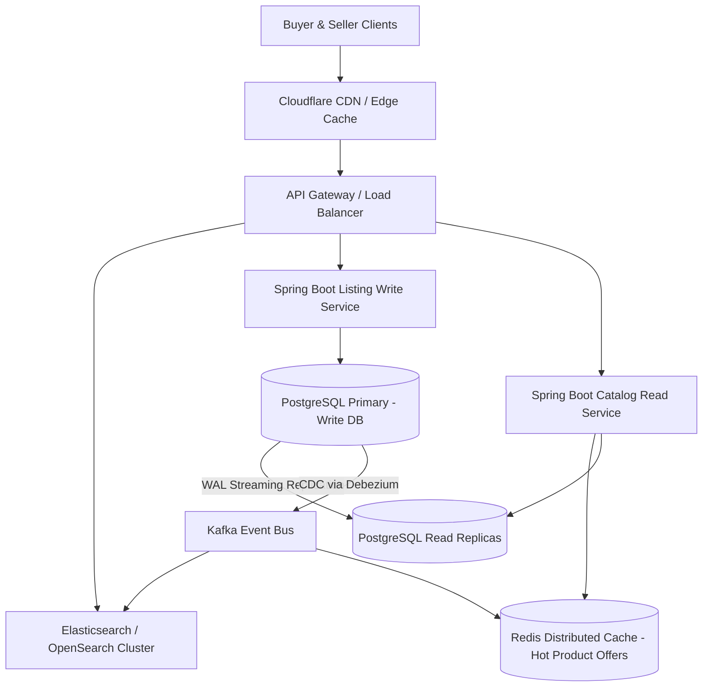

# BajriX - Multi-Seller Construction Materials Marketplace

[](https://spring.io/projects/spring-boot)
[](https://react.dev/)
[](https://vitejs.dev/)
[](https://tailwindcss.com/)
[](https://www.postgresql.org/)
[](LICENSE)

A robust full-stack marketplace platform built for construction and home-building products (cement, TMT steel rebars, river sand, blue metal aggregates, bricks, blocks, and tiles). 

The platform implements a clean separation between **Canonical Products** and **Seller Listings**, multi-seller side-by-side comparison, vendor status lifecycle isolation, and optimistic concurrency control for high-integrity inventory management.

---

## Table of Contents
1. [How to Run the Application](#1-how-to-run-the-application)
2. [Important Architectural Decisions](#2-important-architectural-decisions)
3. [Key Assumptions](#3-key-assumptions)
4. [Intentionally Omitted Functionality](#4-intentionally-omitted-functionality)
5. [What Would Be Improved With More Time](#5-what-would-be-improved-with-more-time)
6. [Scaling to 1M Products, 100K Sellers, 10M Listings](#6-scaling-to-1m-products-100k-sellers-10m-listings)
7. [Automated Testing & Verification](#7-automated-testing--verification)

---

## 1. How to Run the Application

### Prerequisites
- **Java 21+** (Tested on JDK 21 and JDK 25)
- **Node.js 18+** & **npm**
- **Apache Maven 3.8+** (or use installed wrapper)
- *(Optional)* **Docker & Docker Compose** (for PostgreSQL)

---

### Running the Backend

The backend includes a dual-profile configuration:
- **Default (`dev`) Profile**: Uses an in-memory database in PostgreSQL compatibility mode with auto-seeded realistic sample data. Allows zero-friction evaluation without needing external database setup.
- **PostgreSQL (`postgres`) Profile**: Connects to a production PostgreSQL instance.

#### Option A: Quick Start (Default Zero-Friction Setup)
```bash
cd backend
mvn clean test             # Run test suite
mvn spring-boot:run        # Starts backend on http://localhost:8080
```

#### Option B: With Dockerized PostgreSQL
```bash
# From project root, launch PostgreSQL container
docker compose up -d

# Run backend with PostgreSQL profile
cd backend
mvn spring-boot:run -Dspring-boot.run.profiles=postgres
```
*API Base URL*: `http://localhost:8080`  
*H2 Console (Dev mode)*: `http://localhost:8080/h2-console` (JDBC URL: `jdbc:h2:mem:bajrixdb`, User: `sa`, Password: `[empty]`)

---

### Running the Frontend

The frontend is a modern React application built with Vite and Tailwind CSS.

```bash
cd frontend
npm install
npm run dev
```

*Frontend URL*: `http://localhost:3000` (automatically proxies `/api` requests to `http://localhost:8080`).

---

## 2. Important Architectural Decisions

### A. Canonical Product vs. Seller Listing Model
In construction e-commerce, the same physical commodity (e.g., *UltraTech PPC Cement 50 kg*) is manufactured under standard specifications but fulfilled locally by different dealers, distributors, or stockists.
- **`Product` Entity**: Represents the canonical catalog definition (Name, Brand, SKU, Category, Unit of Measurement, Description, Image URL). Managed by platform catalog administrators.
- **`SellerListing` Entity**: Represents a specific seller's commercial offer for a canonical product:
  - `price`: Unit selling price (e.g., ₹385/bag).
  - `availableStock`: Number of units currently available for immediate dispatch.
  - `minOrderQuantity` (MOQ): Enforces bulk/wholesale minimums (e.g., minimum 50 bags).
  - `status`: `ACTIVE`, `INACTIVE`, `OUT_OF_STOCK`.
  - `version`: `@Version` column for atomic optimistic locking.
- **Unique Constraint (`uk_seller_product`)**: Enforces `UNIQUE(seller_id, product_id)`. A single seller cannot create redundant disjoint listings for the same product, preventing catalog clutter and race conditions.

### B. Seller Status Lifecycle & Strict Buyer Visibility Rules
Sellers progress through three verification states: `APPROVED`, `PENDING`, and `REJECTED`.
- **Visibility Invariant**: **Only listings from `APPROVED` sellers with `ACTIVE` listing status appear in the Buyer experience.**
- **`PENDING` Sellers**: Sellers who have registered but have pending KYC/GST verification can log in, populate their catalog, and set prices. However, none of their offerings are exposed to buyers or aggregated into minimum pricing calculations.
- **`REJECTED` Sellers**: Sellers whose documentation or compliance failed are prohibited from creating new listings, and all their listings are suppressed.
- **Demonstration in Sample Data**:
  - `Shree Traders` (APPROVED) & `Rathore Building Materials` (APPROVED) are live on the buyer catalog.
  - `BuildRight Supplies` (PENDING) has listings created in the backend, but they are filtered out from the buyer catalog until approved.
  - `Apex Construction Supplies` (REJECTED) is barred from creating listings.

### C. Authorization & Seller Data Isolation
- To satisfy the challenge requirement without heavy external OAuth/JWT infrastructure, request authorization is modeled using an `X-Seller-Id` header (and matching dropdown selector).
- **Backend Isolation Guard**: All seller mutation endpoints (`PUT`, `DELETE`, `POST`) enforce that the listing being updated belongs to the calling seller:
  ```java
  if (!listing.getSeller().getId().equals(activeSellerId)) {
      throw new UnauthorizedSellerAccessException("Access denied: You cannot modify listings belonging to another seller.");
  }
  ```
  Attempting to tamper with another seller's listing returns `403 FORBIDDEN`.

### D. Concurrency & Lost Update Prevention (Optimistic Locking)
- **Problem**: In high-throughput wholesale environments, two dispatch managers or API sync processes might update stock or price at approximately the same time. A naive `SELECT -> UPDATE` leads to the classic lost update anomaly.
- **Solution**: Implemented JPA `@Version` column on `SellerListing`. Every `PUT` request requires passing the current `version`. If another process committed a modification in the interim, Hibernate detects the mismatch and rejects the stale write.
- **Error Contract**: Mapped in `GlobalExceptionHandler` to **HTTP 409 CONFLICT** with a descriptive payload:
  ```json
  {
    "timestamp": "2026-09-19T14:18:24.431Z",
    "status": 409,
    "error": "Concurrency Conflict",
    "message": "The listing was modified by another transaction. Please reload and try again."
  }
  ```
- **Reviewer Simulation Feature**: The Seller Portal UI includes a dedicated **"Simulate Conflict"** button that sends a stale version to the API, allowing reviewers to observe the HTTP 409 conflict and UI notification in real time.

---

## 3. Key Assumptions

1. **Units of Measurement**: Standardized per canonical product (`bag`, `ton`, `piece`, `box`, `cubic meter`) to ensure apples-to-apples price comparisons across suppliers.
2. **Pricing Currency**: Indian Rupee (INR ₹), stored with two-decimal precision (`BigDecimal` / `NUMERIC(12, 2)`).
3. **Wholesale MOQs**: Construction supplies frequently enforce bulk minimums. Buyer ordering UI incorporates MOQ verification against requested quantities.
4. **Stock Auto-Transition**: When a seller reduces stock to `0`, the listing status automatically switches to `OUT_OF_STOCK` to prevent buyer checkout attempts.

---

## 4. Intentionally Omitted Functionality

As directed by the challenge brief, the following were intentionally excluded to focus on the core domain:
- Real production authentication (OAuth2 / OpenID Connect / JWT token verification).
- Payment gateways, escrow, and checkout processing.
- Multi-party Request for Quote (RFQ) negotiation threads.
- SMS / WhatsApp / Email delivery dispatch alerts.
- Cloud deployment pipelines and Kubernetes manifests.

---

## 5. What Would Be Improved With More Time

1. **Audit Log / Historical Ledger**: Track all price and stock changes in a `listing_audit_log` table with timestamps, user IDs, and before/after values to give sellers analytics on their pricing trends.
2. **Geographical Distance & Freight Engine**: In heavy construction materials (e.g. sand, gravel, cement), freight costs can exceed 30% of product value. Incorporate pincode/distance calculations to rank suppliers by *delivered cost* rather than ex-mill cost.
3. **Bulk Excel/CSV Upload**: Allow sellers to upload thousands of SKU prices and stock levels via an async batch processing queue.
4. **Tiered Volume Pricing**: Support volume discounts (e.g. 10–50 bags at ₹390; 50–200 bags at ₹380; 200+ bags at ₹370).

---

## 6. Scaling to 1M Products, 100K Sellers, 10M Listings

If BajriX scales to production with **1,000,000 products**, **100,000 sellers**, and **10,000,000 active listings**, a traditional single-instance relational approach would degrade. Here is the architectural evolution:



### 1. Database Partitioning & Sharding
- **Composite Primary & Shard Keys**: Partition the `seller_listings` table across multiple physical PostgreSQL nodes using **Hash Partitioning** on `product_id` (or `seller_id` for vendor portals).
- **Index Optimization**:
  - Partial B-Tree indexes: `CREATE INDEX idx_active_approved_listings ON seller_listings(product_id, price) WHERE status = 'ACTIVE'`.
  - Avoid large `COUNT(*)` scans by maintaining real-time denormalized counters or hyperloglog approximations for aggregate metrics.

### 2. Search & Discovery via Dedicated Search Engine (OpenSearch / Elasticsearch)
- Full-text search and faceted filtering (by brand, grade, category, price range, city) across 1M products should not hit relational databases.
- Store a denormalized product document containing:
  - Canonical product metadata.
  - Aggregated min price, max price, seller count, in-stock boolean.
  - Sourced and updated in real-time via **CDC (Change Data Capture)** using Debezium on Postgres WAL logs.

### 3. Caching & Read Replicas (CQRS Pattern)
- **Read/Write Splitting**: Route all seller write operations to the PostgreSQL Primary, while buyer read queries are distributed across read replicas with read-after-write consistency guarantees.
- **Distributed Cache (Redis)**: Cache the top 10% hottest canonical products and their lowest-price seller offerings with a short TTL (e.g., 60 seconds) or cache invalidation events triggered when a seller updates stock/price.

### 4. Concurrency & High-Velocity Inventory Depletion
- Under heavy flash-sale or high-demand procurement, database-level optimistic locking may encounter high contention retry storms.
- Introduce **Redis-based atomic reservation** (using Lua scripts / `DECRBY`) to reserve available stock during checkout before asynchronously committing to PostgreSQL.

---

## 7. Automated Testing & Verification

The project includes an automated test suite verifying core business rules, seller status isolation, and multi-threaded concurrency safety.

### Test Matrix
| Test Suite | Focus Area | Assertions Verified |
| :--- | :--- | :--- |
| `BuyerProductCatalogTest` | Buyer Visibility & Pricing | • Only `APPROVED` sellers' listings are returned.<br>• `PENDING` and `REJECTED` sellers' listings are filtered out.<br>• Offerings are sorted by price ASC.<br>• Cheapest offering is tagged with `lowestPrice = true`. |
| `SellerListingServiceTest` | Business Rules & Isolation | • Price > 0, Stock >= 0, MOQ >= 1.<br>• Duplicate listing creation for same product & seller is rejected.<br>• Rejected sellers cannot create listings.<br>• **Seller Isolation**: Seller A cannot modify or delete Seller B's listings (403 Forbidden).<br>• Stale version updates are rejected. |
| `ConcurrencyTest` | Optimistic Concurrency Control | • Spawns concurrent threads updating the same listing version simultaneously.<br>• Verifies exactly 1 thread succeeds and 1 fails with `OptimisticLockConflictException` (409 Conflict), preventing lost updates.<br>• Verifies DB version is incremented. |

### Run Tests Command
```bash
cd backend
mvn clean test
```
*Result*: **All 8 tests pass with 0 failures, 0 errors.**
